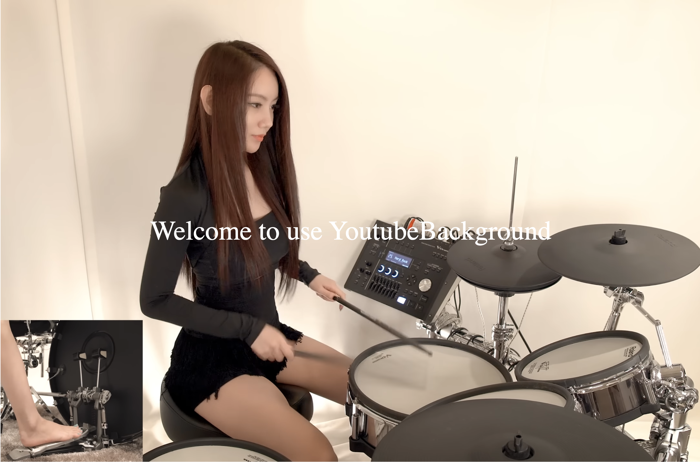

# Vue component for using Youtube video as background.

Very easy to use. 


```vue

<div style="width: 100%; height: 70vh;">
  <YoutubeBackground video-id="rpcFhkFTej4">
    <div class="tagline">Welcome to use YoutubeBackground</div>
  </YoutubeBackground>
</div>

```


